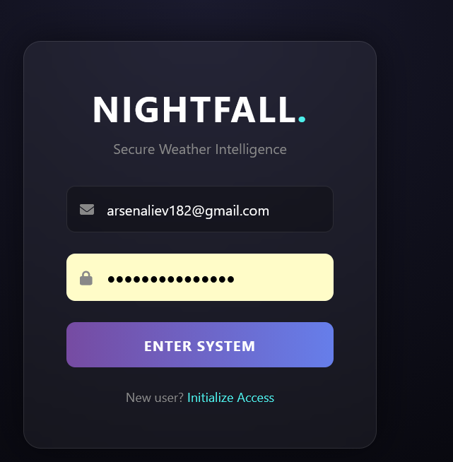
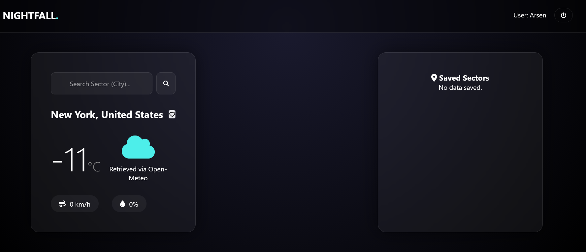
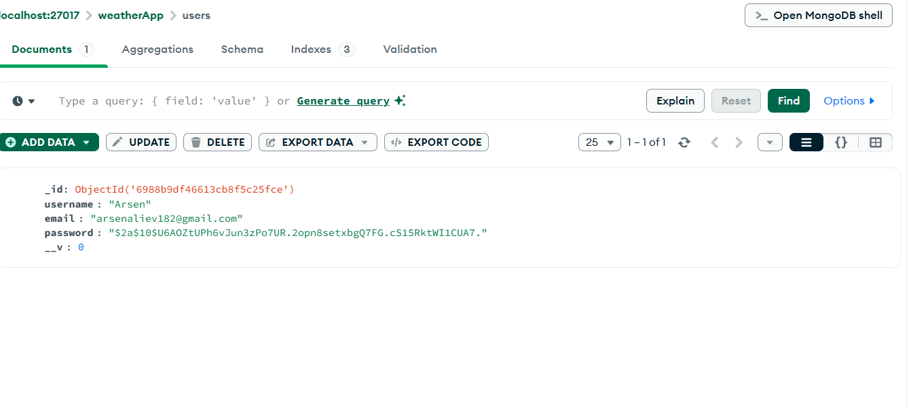

# NIGHTFALL - Personal Weather Intelligence System

## Project Overview
For my final project, I decided to build a weather tracking application called **NIGHTFALL**. Instead of a standard weather app, I wanted to create a high-performance "Command Center" style dashboard with a dark aesthetic. 

The system allows users to create a secure account and save specific "Sectors" (cities) they want to monitor. The app fetches live data from an external API and stores the user's favorite locations in a database so they can see them every time they log in.

## Features & Requirements Met
Based on the project guidelines, I have implemented the following:
* **Modular Architecture:** The backend is organized into separate folders for `models`, `routes`, `controllers`, and `middleware` to keep the code clean and scalable.
* **Database:** I used **MongoDB** and **Mongoose** to handle data.
* **Dual Collections:** I defined two main schemas: `User` (for credentials) and `Favorite` (for saved weather locations).
* **Security:** Passwords are never stored as plain text; I used **bcrypt** for hashing. I also used **JWT** to protect private routes.
* **External API:** I integrated the **Open-Meteo API** to provide real-time weather data for searched cities.

## Setup and Installation
1.  **Clone the repository** to your local machine.
2.  **Install Dependencies:** Open your terminal in the project folder and run:
    npm install
    
3.  **Configure Environment:** Create a `.env` file in the root directory and add your variables:
    * `PORT=3000`
    * `MONGO_URI=********`
    * `JWT_SECRET=*******`
4.  **Launch:** Start the server by running:
    npm start
    
5.  **Access:** Open your browser and go to `http://localhost:3000`.

## API Documentation
The following endpoints were created to handle the application logic:

| Method | Endpoint | Access | Description |
| :--- | :--- | :--- | :--- |
| **POST** | `/api/auth/register` | Public | Registers a new user with a hashed password. |
| **POST** | `/api/auth/login` | Public | Authenticates the user and returns a JWT. |
| **GET** | `/api/weather/data/:city` | Public | Fetches live weather data from Open-Meteo. |
| **POST** | `/api/weather/favorites` | Private | Saves a new city to the user's favorites. |
| **GET** | `/api/weather/favorites` | Private | Returns all cities saved by the logged-in user. |
| **DELETE**| `/api/weather/favorites/:id` | Private | Deletes a specific saved city by its ID. |

## Testing & Validation
I implemented global error-handling middleware to ensure the app returns meaningful messages. 
* **Validation:** I tested the forms to ensure they return a `400 Bad Request` if the user leaves the email or password fields empty.
* **Security Testing:** I verified that trying to access the favorites list without a token returns a `401 Unauthorized` error.

## Screenshots
Below are screenshots of the functional application:

### 1. Login & Register Screen
![Login Screen] 

### 2. Main Dashboard (Live Weather Search)
![Dashboard] 

### 3. Database Verification (MongoDB Atlas)
![Database]

